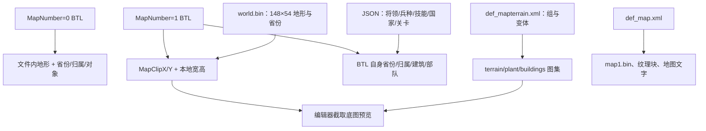

# 《世界征服者 4》1.30.0 解包项目资料

核对日期：2026-10-08。本文描述本机实际目录 `/home/j60100428/game/wc4/World Conqueror 4_1.30.0`，供本编辑器的资源加载、地图编辑、版本对照和后续开发使用。

本文的文件数量、版本、头部、记录数和路径均来自只读核查；格式说明同时参考本仓库当前 codec。尚未确认的游戏行为明确标为待核实。目录索引、完整 JSON/config 清单、关键指纹与统计命令见 [资源索引](resource-index.md)，编辑器缺陷和需求完成程度见 [审计矩阵](../../audits/2026-10-08-project-matrix.md)。

## 阅读导航

| 阅读目的 | 章节 |
|---|---|
| 识别项目版本与文件职责 | [项目身份](#1-这个目录是什么)、[顶层目录](#2-顶层目录与编辑范围)、[assets 总览](#3-assets-总览) |
| 理解地图和坐标 | [BTL 与 world](#4-地图文件btl-与-world)、[地形与省份](#5-16-字节地形省份与归属)、[伴随地图资源](#6-地图伴随-bin纹理块与文字) |
| 查找配置和图片关联 | [JSON 表](#7-json-配置及常见引用)、[XML/图集/PKM](#8-xml图集与-pkm)、[语言与字体](#9-本地化字体与音频) |
| 实际加载与保存项目 | [编辑器与 CLI 操作](#10-用编辑器加载与输出这个项目)、[版本对照和验收](#11-版本对照与后续验收) |
| 查一张表、一个图集或文件指纹 | [资源索引](resource-index.md) |

## 1. 这个目录是什么

这是 **Android APK 的解包目录**，包含编译后的 Manifest、DEX、Android 资源、游戏资产和原生库。没有完整 Java/Kotlin/C++ 源码、Gradle 构建工程或编辑器的 C# 源码。名称中的版本已从 `AndroidManifest.xml` 的二进制 XML 属性核实：

| 项目 | 本机事实 | 说明 |
|---|---|---|
| package | `com.easytech.wc4` | Android 包名 |
| versionName | `1.30.0` | 游戏版本字符串 |
| versionCode | `64` | Android 内部版本编号，与 1.30.0 不是同一计数 |
| minSdkVersion | `21` | Manifest 声明的最低 Android API |
| targetSdkVersion | `34` | Manifest 声明的目标 Android API |
| compileSdkVersion | `34` | Manifest 中的构建信息 |
| 主 Activity | `com.easytech.wc4.WC4Activity` | 已读取的入口类名，不代表该目录提供 Java 源码 |
| 游戏原生库 | `lib/arm64-v8a/libworld-conqueror-4.so` | 此目录只有这一份 native library，没有发现其他 ABI 目录 |
| Native 格式 | ELF64、little-endian、AArch64、stripped | 11,015,960 字节，BuildID 为 `6390ada80a36790c2e035085cc4ba14eb980e625` |
| 全项目 | 4,580 文件，278,847,745 字节 | 约 265.93 MiB；不含文件系统目录开销 |
| assets | 3,474 文件，241,964,843 字节 | 约 230.76 MiB，编辑器主要操作对象 |

`AndroidManifest.xml` 和 `res` 下许多 XML 是 Android 编译格式，不能按普通文本 XML 编辑。`classes.dex`、`classes2.dex` 是编译后的字节码。原生库依赖 `libandroid.so`、`libGLESv2.so`、`libOpenSLES.so` 等 Android 系统库，不能直接当 Linux 桌面库运行。

`META-INF/ANDROID.RSA`、`ANDROID.SF`、`MANIFEST.MF` 存在，但本文没有验证原 APK 签名、下载来源或解包过程。版本属性和关键文件指纹用于识别这一份本地样本，不能据此断言任何同名目录都与它完全相同。

## 2. 顶层目录与编辑范围

```text
World Conqueror 4_1.30.0/
  AndroidManifest.xml       Android 二进制 Manifest
  classes.dex               第一份 DEX
  classes2.dex              第二份 DEX
  resources.arsc            编译资源表
  assets/                   游戏地图、配置、美术、语言和音频
  lib/arm64-v8a/
    libworld-conqueror-4.so  Android 游戏原生库
  res/                      Android 编译资源与图片
  META-INF/                 APK 签名相关文件
  com/                      随包资源、properties 等
  kotlin/                   Kotlin builtins 元数据
  okhttp3/                  publicsuffix 等随包资源
```

| 顶层范围 | 文件数 | 本编辑器如何处理 |
|---|---:|---|
| `assets/` | 3,474 | 扫描与分类；已支持格式进入对应编辑器 |
| `res/` | 1,085 | 完整复制；不提供 Android 资源表/二进制 XML 编辑流程 |
| 顶层四个文件 | 4 | 原样复制；不重新编译 Manifest 或 DEX |
| `lib/` | 1 | 原样复制；本轮没有改 SO 或扩展游戏引擎 |
| `META-INF/` | 3 | 原样复制；编辑后打包不能依靠旧签名文件得到有效 APK |
| `com/` / `kotlin/` / `okhttp3/` | 4 / 7 / 2 | 原样复制；不把这些目录当源码工程 |

本仓库自身是 Windows WPF 资源编辑器。项目模式创建完整副本，再让资源根指向副本中的 `assets`；**复制完整解包目录并不等于重打包、签名或安装成功**。

## 3. assets 总览

```text
assets/
  stage/                    1,383 张 BTL：战役、征服、活动等
  json/                     81 张配置表，共 22,055 行
  config/                   20 份 XML 定义
  image/                    1,196 文件：UI 图集、头像、活动图等
  map/                      384 张 PKM 大地图纹理块
  font/                     65 文件：字体、位图字体描述及图片
  audio/                    63 文件：61 WAV、2 MP3
  shader/                   16 文件：8 FSH、8 VSH
  effect/                   8 份效果 XML
  tutorials/                6 份教程脚本 XML
  recommend/                19 张图片
  *.lproj/                  8 套语言资源目录，各有 2 文件
  google/、dexopt/          随包组件与编译配置
  world.bin                 完整世界逻辑格数据
  map1.bin、map1_hd.bin      大地图伴随二进制
  terrain*.xml/webp         地形图集
  plant_hd.xml/png          植物图集
  buildings_hd.xml/webp     建筑图集
  coast*.xml/pkm            海岸与遮罩
  tacticalmap.*             战术图集及伴随数据
  unit_*.*、anim_*.*        单位与动画图片、XML、BIN
  layout.xml、layout_x.xml   游戏 UI 布局
  stringtable_*.ini         7 套主要字符串表
```

assets 根目录自身有 **208 个文件**。因此只扫描 `assets/image` 或只复制 `stage` 会漏掉 world、地形图集、单位动画、布局和语言等关联资源。这里的 `map/` 主要存纹理块，实际可部署部队的关卡文件在 `stage/`，不要仅按目录名理解“地图”。

assets 后缀总数为：BTL 1,383，WebP 900，PNG 360，PKM 417，XML 144，JSON 84，BIN 51，WAV 61，FNT 29，STRINGS 8，INI 7，OTF 7，FSH/VSH 各 8，SHP 2，MP3 2，JS/PROFM/PROF 各 1。其中 84 个 JSON 包含 `json/` 的 81 张数组表，及根目录三个对象型 JSON；不是 84 张均可用同一编辑器打开的表。

## 4. 地图文件：BTL 与 world

### 4.1 stage 目录的八类 BTL

分类来自实际文件名前缀，地形来源另由头部 `MapNumber` 判断；例如名为 stage 的地图也可能引用 world。

| 文件族 | 数量 | v1 / v2 / v3 | 自带地形 / 引用 world | 常用配置入口 |
|---|---:|---|---|---|
| `stage*.btl` | 295 | 207 / 2 / 86 | 187 / 108 | `StageSettings.json` |
| `conquest*.btl` | 9 | 0 / 0 / 9 | 0 / 9 | `ConquerSettings`、`ConquerCountrySettings` |
| `event*.btl` | 731 | 0 / 0 / 731 | 571 / 160 | `EventSettings`、`EventStageSettings` |
| `frontier*.btl` | 213 | 209 / 0 / 4 | 180 / 33 | `FrontierStageSetting`、`def_frontierarmy.xml` |
| `generalstage_*.btl` | 40 | 0 / 0 / 40 | 40 / 0 | `GeneralStageSettings.json` |
| `legend*.btl` | 60 | 0 / 0 / 60 | 60 / 0 | `LegendStageSettings.json` |
| `warzone*.btl` | 25 | 0 / 23 / 2 | 25 / 0 | `WarZoneStageSetting`、`def_warzone_stage.xml` |
| `invadecorps*.btl` | 10 | 9 / 0 / 1 | 10 / 0 | `InvasionSettings`、`InvasionGeneralSettings`，文件映射需另外核实 |
| 合计 | 1,383 | 425 / 25 / 933 | 1,073 / 310 | 全部 310 张外部地图均使用 MapNumber=1 |

本样本 BTL 的宽范围为 6–148 格，高范围为 5–100 格；两个范围的最值不一定来自同一地图。最小面积样本 `stage60001.btl` 为 7×5，最大面积样本 `event80301.btl` 为 130×100。不能把 world 的 148×54 当作所有 BTL 的统一尺寸。

### 4.2 头部里的关键字段

BTL 没有 world 的 YSAE magic，头部是 **128 字节、32 个 32 位小端字段**。解析需要按头部计数计算整个文件长度，再确认版本与所有区段。

| 偏移 | 当前模型名 | 含义或注意事项 |
|---|---|---|
| `0x00` | BtlVersion | 1/2/3 决定单位、援军等记录布局 |
| `0x04` | MapNumber | 0 为文件内地形；本样本外部引用为 1 |
| `0x08` / `0x0C` | MapClipX / MapClipY | 外部 world 捕获窗口原点，单位是逻辑格 |
| `0x10` | MapLength | **列数/宽**；旧命名容易与高度混淆 |
| `0x14` | MapWidth | **行数/高**；转到 MapData 后宽名为 MapWidth、高名为 MapHeight |
| `0x18` | ArmyCount | 当前 codec 对应 300 字节的 Legions 数量，不是部署部队条数 |
| `0x1C` | BuildingCount | 32 字节建筑条数 |
| `0x20` | TroopCount | 部署部队条数，v1 每条 48 字节，v2/v3 每条 64 字节 |
| `0x3C` | ReinforcementCount | 援军条数，v1 每条 80 字节，v2/v3 每条 104 字节 |
| `0x58` | SelectableTileCount | 省份/归属平面容量；不能直接替代宽×高作为地形格数 |
| `0x68` | TrapCount | 12 字节陷阱条数 |

完整字段和区段位置以 [BTLHeader](../../../WC4MapEditor.Core/Models/BTLHeader.cs)、[BtlLayout](../../../WC4MapEditor.Core/Parsers/BTL/BtlLayout.cs)为准。顺序包含头部、军团、可选地形、省份、归属、建筑、部队、陷阱、方案、天气、事件、援军、空袭、Placement A/B、首都、opaque、策略建筑、空援和 v3 extra。

头部为 0 容量时，当前 codec 使用面积；非零容量需介于面积与向上对齐到 8 格的值之间。省份和归属有独立 padding，未知段及 reserved 字段也必须保留。文件名或某一个计数“看着合理”，不足以判定文件可安全保存。

### 4.3 world.bin 的真实布局

`assets/world.bin` 为 **148×54，共 7,992 格**，文件长 **143,872 字节**。与 `map1.bin` 等伴随文件格式不同：

| 范围 | 字节数 | 内容 |
|---|---:|---|
| `0x00` | 4 | ASCII `YSAE`：`59 53 41 45` |
| `0x04` | 4 | 版本 4，小端整数 |
| `0x08` / `0x0C` | 各 4 | 宽 148、高 54 |
| 从 `0x10` 开始 | 127,872 | 7,992 条地形，每条 16 字节 |
| 从 `0x1F390` 开始 | 15,984 | 7,992 条省份，每条 2 字节 |
| 总长 | 143,872 | `16 + 148 × 54 × (16 + 2)` |

两平面连续存储，**不是每格 16+2 字节交错排列**。world 没有 BTL 的部署军团/建筑/部队区段；这些内容在引用它的 BTL 中。当前 GUI 只开放 world 地形编辑，省份平面由 codec 保真保存，尚无对应 GUI 模式。

### 4.4 capture、坐标与关联文件

本编辑器的逻辑索引是 `index = row × width + col`，六边格采用平顶、奇数列下移半格。BTL 内对象使用其本地窗口坐标，外部地形从 world 读取：

```text
worldCol = (MapClipX + localCol) % worldWidth
worldRow = MapClipY + localRow
```

横向取模来自已验证的真实跨右边界窗口；不是所有算法、所有地图都自动左右环绕。纵向没有环绕，capture 的行范围必须位于 world 内。

| 样本 | 版本与来源 | 本地尺寸 | capture | 适合核查的内容 |
|---|---|---|---|---|
| `stage10103.btl` | v1，MapNumber=0 | 18×16 | `(0,0)` | 文件自身地形；9 军团、27 建筑、55 部队 |
| `conquest1.btl` | v3，MapNumber=1 | 148×50 | `(0,2)` | world 截取；43 军团、297 建筑、396 部队、104 援军 |
| `generalstage_101.btl` | v3，MapNumber=0 | 32×28 | `(0,0)` | 版本化部队记录和本地地形 |
| `frontier80407.btl` | v1，MapNumber=1 | 18×12 | `(133,18)` | 横跨 world 右边界 |
| `stage60023.btl` | v1，MapNumber=1 | 10×8 | `(147,4)` | 从最右列开始的捕获窗口 |

310 张外部地图有 164 张 X 原点为奇数。数据截取已验证；世界奇偶列与本地奇偶列的画布锚点、对象中心和点击位置仍需 Windows 对照。原游戏像素坐标不能直接套用编辑器 Camera 的缩放坐标。



图中的箭头表示资源读取或展示关系，不表示编辑器已经能联动写回全部文件。当前项目模式禁止在外部 BTL 场景改变地形、MapNumber、capture 或尺寸；需在 world 场景保存后重新打开 BTL。未保存的 world 修改不会自动同步。

## 5. 16 字节地形、省份与归属

### 5.1 地形格不能只当作一个地形编号

当前 [TerrainData](../../../WC4MapEditor.Core/Models/TerrainData.cs)按以下顺序保留 16 字节：

| 字节偏移 | 模型字段 | 编辑时的约定 |
|---|---|---|
| 0–3 | TileType1、DecorationType1、TextureOffsetX1/Y1 | 第一层组、变体/装饰和偏移 |
| 4–7 | TileType2、DecorationType2、TextureOffsetX2/Y2 | 第二层数据，不能因只改第一层而清空 |
| 8–11 | TileType3、DecorationType3、TextureOffsetX3/Y3 | 第三层数据，同样需保留 |
| 12–13 | Reserved1、Reserved2 | 语义未全面确认，保留原值 |
| 14 | RiverValue | 当前编辑器使用六边位掩码，并同步邻格对边 |
| 15 | Reserved3 | 保留原值，不当作无用尾字节删除 |

模型名代表当前解析约定，未声明所有字节的游戏完整语义。河流六边顺序为北、东北、东南、南、西南、西北，对边索引为 `(edge + 3) % 6`；单位的八向 Direction 编码与它不是同一种编号。

### 5.2 地形定义与图片变体

`config/def_mapterrain.xml` 有 **24 个 terrain 定义、193 个 tile 节点**，其中 **190 个节点带 image 属性**。0 组和 1 组的三个节点没有独立 image，因此“190 个已验证图片变体”不等于整个文件只有 190 个 tile。

| terrain 组 | 游戏 type | 变体数 | 图片命名或用途 |
|---|---:|---:|---|
| 0 | 0 | 1 | 平原，无独立 image 属性 |
| 1 | 1 | 2 | 海洋，无独立 image 属性 |
| 2 | 2 | 9 | `desert_*` |
| 3 / 4 / 5 | 3 / 4 / 5 | 11 / 11 / 5 | `l1_` / `m1_` / `h1_mountain_*` |
| 6 / 7 / 8 | 3 / 4 / 5 | 11 / 11 / 5 | `l2_` / `m2_` / `h2_mountain_*` |
| 9 / 10 / 11 | 3 / 4 / 5 | 11 / 11 / 5 | `l3_` / `m3_` / `h3_mountain_*` |
| 12 / 13 / 14 | 3 / 4 / 5 | 11 / 11 / 5 | `l4_` / `m4_` / `h4_mountain_*` |
| 15 | 2 | 9 | `cactus_*` |
| 16 / 18 / 20 / 21 / 22 | 7 | 各 9 | broadleaf、broadleaf2、coniferous、coniferous2、palmae |
| 26 | 10 | 1 | `building_1.png`，农田样式；不是 BTL BuildingType=26 的定义 |
| 30 / 31 | 10 | 各 9 | `hollow_*`、`snowfield_*` 装饰 |

`terrain` 是图片组编号，`type` 对应 `def_terraintype.xml` 的移动成本/惩罚类型，`idx` 是组内变体。三者不能相互替换。实际 group 编号存在空缺，不能用数组下标假设连续 0–23。

`def_mapterrain.xml` 的 name 属性有既存乱码/空名称，但其 terrain/type/idx/image 可读取。该文件可严格按 UTF-8 解码，不能因为部分中文名称异常就整体强制转换为 GBK；图片索引仍应以编号与实际 image 属性为准。

### 5.3 省份和归属分别处理

省份是 2 字节小端值；当前编辑器以 `0xFFFF` 表示未分配省份。它不是“低字节等于国家 Id”的通用规则。BTL 的归属是另一份 1 字节平面，军团中的 ActionId、CountryId 又各有角色；外部图的归属编码还存在 codec 的偏移约定。

修改国家、军团、省份或地图尺寸时，要分别核对这些平面与对象引用，不直接把 CountrySettings.Id 写遍全部二进制字段。当前 codec 会保留无修改文件的原字节，但字段意义和游戏行为仍需要对应版本样本验证。

## 6. 地图伴随 BIN、纹理块与文字

| 文件 | 本机事实 | 与 world 的区别 |
|---|---|---|
| `world.bin` | YSAE/v4，143,872 字节，148×54 格 | 完整逻辑地形与省份 |
| `map1.bin` | 28,388 字节，首两个小端 int 为 7,992 / 3,361 | 与 def_map 的显示尺寸相符；不是 world 格数组 |
| `map1_hd.bin` | 28,388 字节，首两个小端 int 为 15,984 / 6,722 | 尺寸为前者两倍；不能据此断言任意扩图已受游戏支持 |
| `maptext.bin` | 99,310 字节，以 `BILE` 和版本 4 开始 | 地图文字伴随数据，结构未接入通用 world 编辑 |
| `maptext.xml` / `.webp` | XML 定义 267 图块 | 字形/标签图集与锚点 |
| `maptextpos.xml` | Layers/Layer 布局 | 文字位置；不同于 BTL 单位坐标 |
| `map/map1_1@2x.pkm` 等 | 192 张 `map1_` 与 192 张 `map1_a`，共 384 张 | 大地图分块纹理，两组含义和排序需游戏对照 |
| `smap*.pkm` | 根目录的概览/前线相关命名图片 | 展示图片，不是新增 BTL 地形区段 |
| `unit_*.bin` / `anim_*.bin` | 多数以 `BILE`、版本 4 开始 | 单位/动画伴随文件，不能按 YSAE 地图格式处理 |

`config/def_map.xml` 的唯一 map 记录为：id=1，name=world，file=world.bin，w=7992，h=3361，tile=map1.bin，tilesize=64，patternsize=512。**w/h 是该定义里的显示尺寸，world 头部是 148/54 逻辑格。** 数值 7,992 同时等于格总数只是此样本的数值重合，单位不同。

该记录还写着 `textpos="maptextpos_world.xml"` 与 `pattern="map_pt.png"`，这两个按字面路径的文件在本目录中没有发现；实际存在的是 `maptextpos.xml` 等资源。本文记录这种不一致，尚未确认游戏是否存在别名、替代资源或不用这些属性的分支，不能直接按“缺文件”自动补造。

改变 world 尺寸后，纹理块、map1 伴随数据、地图文字、镜头和原生逻辑不会由当前编辑器一起更新。地图变换 codec 成功不等于完成游戏地图扩展。

## 7. JSON 配置及常见引用

### 7.1 81 张表的分工

`assets/json` 的 81 个文件全部是数组，共 **22,055 行**。完整逐表数量见 [资源索引](resource-index.md)。核心表包括：

| 范围 | 关键表与记录数 | 常见关联 |
|---|---|---|
| 将领 | GeneralSettings 1,189；GeneralPromotion 43；GeneralTitle 8；GeneralStage 40 | 技能、晋升链、称号、关卡、头像和部署 General 字段 |
| 兵种 | ArmySettings 736；ArmyFeature 461；ArmyBuff 172；EliteArmy 552 | 配置行 Id、部署 Army 代码、特性 Type/Level、动画名称 |
| 技能 | SkillSettings 901 | Id、Type、Level、UpgradeId；将领 Skills 使用具体技能 Id |
| 国家/征服 | CountrySettings 60；ConquerSettings 10；ConquerCountrySettings 356；CountryTech 375 | 国家、征服版本、席位、阵营、科技及旗帜 |
| 战役/据点 | StageSettings 295；CitySettings 151；ScenarioSettings 6 | 关卡 Id、解锁、奖励、将领和战役组织 |
| 活动/集团军 | EventSettings 188；EventStage 731；ArmyGroup 278；ArmyGroupReinforcement 1,648 | EventId、StageId、CountryId、GeneralId 与事件触发 |
| 前线/传奇/战区 | FrontierStage 213；LegendStage 60；WarZoneStage 25 | 关卡和前置、奖励、战区定义，部分依赖 config XML |
| 建筑/设施/科技 | BuildingSettings 18；Facility 33；Technology 191；TechResearch 11 | 兵种解锁、设施属性、科技层级 |
| 奖励/商店/成长 | Pay、Pass、Prize、Quest、Item、Level 等 | 物品与奖励引用；不能把改一行理解为所有关联自动迁移 |

ArmyLevelSettings 以 `Level`、CorpsSettings 以 `Lv`、TechResearchSettings 以 `Level` 描述层级，原行没有统一 Id。不能为所有表强制制造 Id，更不能按 Id 合并掉合法原行。

### 7.2 Id、Army、Level 与 Photo 的区别

- `ArmySettings.Id` 是配置行 Id，例如轻型步兵样本为 101001；部署记录的 UnitType 对照 `ArmySettings.Army`，该样本为 1。本项目共有 103 种 Army 代码，不是 736 种部署代码。
- `SkillSettings.Id` 是具体技能条目；Type/Level 另有含义。GeneralSettings.Skills 保存 Id，BTL 五技能槽保存等级，不能把技能 Id 写入一字节等级槽。
- GeneralSettings 的 Id 与 EName/Photo 不同。样本张自忠的 Id=1001、EName=Photo=`Zhang.Z.Z`，图片路径使用字符串键。
- `ArmyGroupEventSettings.StageId` 是本文件实际存在的关联字段，310 行都有；当前专用模型未直接展示，但本轮保存合并已保留，不能因面板没有它就删掉。
- CountrySettings.Id、ConquerCountrySettings.CountryId、BTL 军团 ActionId 和单位 LegionId 不能仅按名称类似视为同一种索引。

以下文件族与对应配置 Id 在本样本中逐一相符：stage/StageSettings、event/EventStageSettings、frontier/FrontierStageSetting、generalstage/GeneralStageSettings、legend/LegendStageSettings、warzone/WarZoneStageSetting。两类例外需要保留解释空间：

| 对照 | 实际观察 | 不能据此自动得出的结论 |
|---|---|---|
| ConquerSettings | 10 行，文件 conquest 只有 1–9；Id=10 没有同名 BTL | 不能直接认定必须生成 conquest10；需核对 NormalId、可见性及游戏加载分支 |
| InvasionSettings | Id 为 1–10；invadecorps 文件后缀含 0、11、12，未发现同名 7、8、9 | 不能统一套用文件名=Id，应确认关卡选择/映射逻辑 |

### 7.3 配置编辑的已验证范围

专用 JSON 回归检查 **17 张表、6,908 行**，其中 **16 张可写表实际保存后语义一致**，ConquerSettings 是只读对照；GeneralSettings 在独立将领测试中验证。本机其他版本将领语料合计 5 张表/6,035 行，不是本 1.30.0 目录有五份 GeneralSettings。

当前保留未知字段、未改 token、null、缺省和重复 Id；JSON 空白/缩进/注释不承诺原样保留，外部文本编辑与专用界面的并发冲突尚未检测。外部修改配置后应刷新或重新打开编辑器。

只读关系审计覆盖 32 类显式 JSON 关系及 BTL 部署部队；本样本 155,576 条提取引用均 resolved。1,066 条规则诊断中 1,062 条为 SkillsMax=0 与既有 Skills 冲突，4 条为 Army Id 349001–349004 的 Feature/FeatureLevel 长度不同。游戏对这些字段的语义仍需核实，不应为让诊断归零而清除原数据；82,843 条援军记录明确跳过。

## 8. XML、图集与 PKM

### 8.1 config XML 与布局

`config/` 的 20 份 XML 清单见 [资源索引](resource-index.md)。其中 `def_map` 选底图，`def_mapterrain` 定义变体，`def_terraintype` 定义移动与惩罚，`def_armypos` 有 23 个 unit，`def_portraitpos` 有 179 个 general，`def_tacticalmap` 有 65 项，`def_citycoord` 有 179 个 City。

单位移动/动画还关联 `def_motion` 的 287 个 Unit，特效关联 `def_effectsanim` 的 107 项，前线和战区关联另外的定义。解析这些文件只代表对应功能能读取特定 XML，不表示一个图集编辑器可修改所有 XML 游戏逻辑。

根目录 `layout.xml`（527,306 字节）和 `layout_x.xml`（528,772 字节）是游戏 UI 布局；`image_resource.xml`、`font_resource.xml` 为相应资源描述，`global_data.xml` 保存游戏全局配置。编辑器已有布局预览/导出入口，但没有逐控件与原游戏对照完整验收。

### 8.2 典型图集与真实图片后缀

| XML | Image 条数 | 实际图片 | 原 Texture.name |
|---|---:|---|---|
| `terrain.xml` | 117 | `terrain.webp` | terrain.png |
| `terrain_hd.xml` | 117 | `terrain_hd.webp` | terrain_hd.png |
| `plant_hd.xml` | 72 | `plant_hd.png` | plant_hd.png |
| `buildings_hd.xml` | 40 | `buildings_hd.webp` | buildings_hd.png |
| `coast_hd.xml` | 90 | `coast_hd.pkm` | coast_hd.png |
| `coastmask_hd.xml` | 90 | `coastmask_hd.pkm` | coastmask_hd.png |
| `tacticalmap.xml` | 408 | `tacticalmap.webp` | tacticalmap.png |
| `image/image_flags_hd.xml` | 75 | `image/image_flags_hd.webp` | image_flags_hd.png |
| `maptext.xml` | 267 | `maptext.webp` | maptext.png |

这些 XML 常以 `<Texture .../>` 和 `<Images>...</Images>` 两个顶层片段保存，未必有单一根元素。读取时可临时包一层根节点；不能用一次普通 XML parse 失败就判定文件损坏。

Image 的 x/y/w/h 是图集裁切范围，refx/refy 是锚点。**图集内的 `h1_mountain_1.png` 是图块名字，不要求目录里另有同名独立 PNG**。实际图片后缀、Texture 的声明、图块名是三层不同信息；扩展名回退要保持同 stem 和对应版本，不应从另一项目拿任意同名资源。

已核对的 190 个地形图片变体包括 terrain_hd 117、plant_hd 72、buildings_hd 中农田 1；不是 buildings_hd 全部 40 个建筑图块都已经接入地图绘制。裁切像素一致也不代替锚点、比例和全部对象显示验收。

### 8.3 PKM 的实际格式

417 份 PKM 全部为 **`PKM 10`、format code 0，即 ETC1 RGB 数据**；头部 16 字节，各尺寸字段为大端 uint16。全部文件长度符合此样本 `16 + encodedWidth × encodedHeight / 2`。

| 编码尺寸与实际尺寸 | 数量 | 典型位置 |
|---|---:|---|
| 512×512 | 384 | `assets/map/` 全部两组分块纹理 |
| 1024×1024 | 17 | 海岸/部分背景与小地图 |
| 2048×2048 | 9 | smap、image/map 部分图片 |
| 2048×1024 | 7 | 部分战术背景 |

`def_tacticalmap.xml` 的 65 项均用 `.png` 字面路径，而这份目录中对应的 13 份 `image/map/01–13` 实际为 `.pkm`；逐项按 stem 检查均存在 PKM 替代。大地图的 `map1_a` 命名可能与另一层/遮罩相关，但本文没有确认游戏合成语义；ETC1 RGB 本身不代表透明 PNG。

当前 Skia 图片入口未接入 ETC1 解码，417 个文件能复制和索引，不能据此说它们可正确预览/编辑。不能通过改后缀把 PKM 变成 PNG，也不能只改 Texture.name 而保留不匹配的二进制内容。

### 8.4 头像与国家旗帜

| 资源 | 当前目录中的实际约定 | 备注 |
|---|---|---|
| 半身像 | `image/generalphoto/general_<Photo或EName>.webp/png`，目录 169 文件 | GetGeneralPhotoPath 优先已有 WebP |
| 圆形头像 | `image/heads/general_circle_<Photo或EName>.webp/png`，目录 247 文件 | 不在 generalphoto 目录中 |
| 国家旗帜 | `image/image_flags_hd.xml/webp` 的 flag 图块、tacticalmap 图块 | 75 个 HD flag 条目，不等于 CountrySettings 只有 75 个或每个国家只有一图片 |
| 单位动画 | 根目录 `unit_infantry`、`unit_panzer`、`unit_ship`、`unit_elite*` 等三件套 | PNG/WebP + XML + BILE BIN 不能当作只有一张普通 PNG |

例如张自忠实际对应 `generalphoto/general_Zhang.Z.Z.webp` 与 `heads/general_circle_Zhang.Z.Z.webp`。当前头像制作服务的输出目录/编码与查询尚有不一致；修改后必须检查真实路径，不能仅凭“保存成功”判断游戏或预览已使用新图。

## 9. 本地化、字体与音频

主要字符串表为 `stringtable_cn.ini`、`tw`、`en`、`de`、`es`、`ja`、`ko` 七套。它们保存游戏文本键，包含城市、国家、技能、事件等命名。当前部分专用编辑器固定使用 `stringtable_tw.ini`，不等于项目没有简体中文，也不代表改繁体表会同步七种语言。

另有 `Base.lproj`、`zh_CN.lproj`、`zh_TW.lproj`、`en.lproj`、`de.lproj`、`es.lproj`、`ja.lproj`、`ko.lproj`，各包含 `locstrings.xml` 与 `InfoPlist.strings`。这些是实际随包资源；目录带 `.lproj` 不表示这是完整 iOS 工程，Android 版本应由 Manifest 和 native 目录判断。

font 的 65 文件由 7 OTF、29 FNT 与 29 PNG 组成。FNT 与图片配套，FontResource 另有命名/类型规则；修改地图文字、美术字或布局字体时要核对对应字体和字形资源。audio 的 63 文件为 61 WAV、2 MP3，本轮只有保留/浏览，没有音频编辑或播放完整验收。shader 的 8 FSH 与 8 VSH 也未进行编辑后原游戏编译验证。

## 10. 用编辑器加载与输出这个项目

### 10.1 正常工作流

1. 在 Windows 从完整构建目录启动编辑器，首页进入“游戏项目”。
2. 选择本解包根目录；输出选新的或空的独立目录，如 `World Conqueror 4_1.30.0-edited`。
3. 工具完整复制源项目，额外生成 `.wc4-project.json`；成功后所有资源根指向输出 `assets`。
4. 打开本地地形 BTL、world 或已有专用编辑器；Save/Ctrl+S 将支持的结果写到输出原相对路径。
5. 外部 BTL 只改其自身对象/省份/归属；改底图时单独保存 world，再重新打开 BTL。
6. 以后通过“继续编辑项目”选择输出根，读取上次已保存结果，不重新复制覆盖。

```text
源：World Conqueror 4_1.30.0/assets/stage/stage10103.btl
输出：World Conqueror 4_1.30.0-edited/assets/stage/stage10103.btl

输出根额外有：.wc4-project.json
其余未编辑文件及 assets 外文件仍按原结构保留
```

直接选 `assets` 作为来源时，输出根本身就是 assets，不能再假设多出一层 assets。完整项目模式的输入/输出不能相同或互相包含，也不接受目录/文件链接；输出非空时应继续编辑，不能用 create 强制覆盖。

### 10.2 支持范围速查

| 操作 | 当前范围 |
|---|---|
| 完整副本、取消、重开、源保护 | 已有真实项目及失败用例验证 |
| BTL 与 world 读写 | 本项目全部 BTL 往返保真，world 读写/修改重读通过 |
| 本地地形、对象、省份、归属 | 复用已有模式；全部实际窗口操作待验收 |
| 外部 world BTL | 底图预览可用；关联地形/捕获/尺寸修改明确拒绝保存 |
| 主要 JSON/XML/图集 | 专用入口部分已验证，通用文本可在副本外部编辑 |
| PKM、完整海岸/兵种美术、所有辅助 BIN | 尚未提供完整可视化编辑 |
| world/BTL 联动、归档浏览、重打包/签名 | 尚未实现完整流程 |
| 原游戏镜头、寻路、AI、回合、存档、事件、SO | 需要单独原游戏验收 |

离开窗口前显式保存：主窗口/部分编辑器还缺统一未保存确认，场景缓存仅用于当前进程，完整 undo 历史不会随场景恢复。其他已知问题、严重程度和证据见 [审计矩阵](../../audits/2026-10-08-project-matrix.md)。

### 10.3 CLI 示例

以下命令从编辑器仓库根执行。`dotnet` 需要 .NET 10 SDK；本机 SDK 路径为 `/home/j60100428/game/tmp/dotnet/dotnet`。带空格的项目路径始终引用。

```bash
# 只读查看 BTL / world；不传修改命令
dotnet run --project WC4MapEditor.Cli -- stage \
  "/home/j60100428/game/wc4/World Conqueror 4_1.30.0/assets/stage/stage10103.btl" --analyze
dotnet run --project WC4MapEditor.Cli -- world \
  "/home/j60100428/game/wc4/World Conqueror 4_1.30.0/assets/world.bin" --analyze

# 创建完整编辑副本；这是本组示例里会写项目目录的操作
dotnet run --project WC4MapEditor.Cli -- project create \
  "/home/j60100428/game/wc4/World Conqueror 4_1.30.0" \
  "/home/j60100428/game/wc4/World Conqueror 4_1.30.0-edited"
dotnet run --project WC4MapEditor.Cli -- project info \
  "/home/j60100428/game/wc4/World Conqueror 4_1.30.0-edited"

# 报告位于输入外，且必须是未存在的新文件
dotnet run --project WC4MapEditor.Cli -- asset audit \
  "/home/j60100428/game/wc4/World Conqueror 4_1.30.0/assets" \
  --include-maps --output tmp/wc4-1300-reference-audit.json
```

project create/info 成功退出 0，调用/创建/读取失败退出 2；asset audit 的 1 表示存在 error 诊断，2 才是调用/读取/导出失败。CLI 独立文件命令没有 GUI 项目会话保护，编辑时应明确传输出副本路径。

## 11. 版本对照与后续验收

版本选择至少核对 Manifest、world 格尺寸、BTL 版本分布、关键 JSON/图集和文件指纹；不要把本仓库默认内置表、旧 fork 或 Android 参考工程的同名文件直接覆盖到 1.30.0。例如本目录 ArmySettings 为 736 行、CountryTechSettings 为 375 行，与本仓库其他历史资源的数量不同。

本次已有验证：4,580 文件复制与源哈希不变，1,383 项目 BTL 无修改保存字节一致，190 地形变体裁切像素一致，以及主要 JSON 配置保存语义回归。全语料 5,523 张 BTL 和 5 张将领表是多版本测试范围，不能混写成这个目录的文件数量。

后续按下面顺序核查：地图基础加载/编辑/保存/重开，capture 奇偶列与对象点击，配置与图片跨文件一致性，PKM/图集锚点，布局/语言，最后是打包安装与原游戏运行。每一步记录输入指纹、实际改动的文件、编辑器结果和游戏结果，避免单凭文件能重读就宣布扩图、十技能或引擎能力已经完成。

本文为项目资料节点，后续新发现追加日期与证据；已有历史 README 保持原样。资料与 2026-10-08 项目加载和审计修复一起纳入本次合并提交，核查没有修改原游戏目录。
